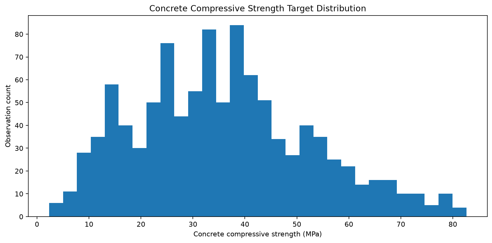
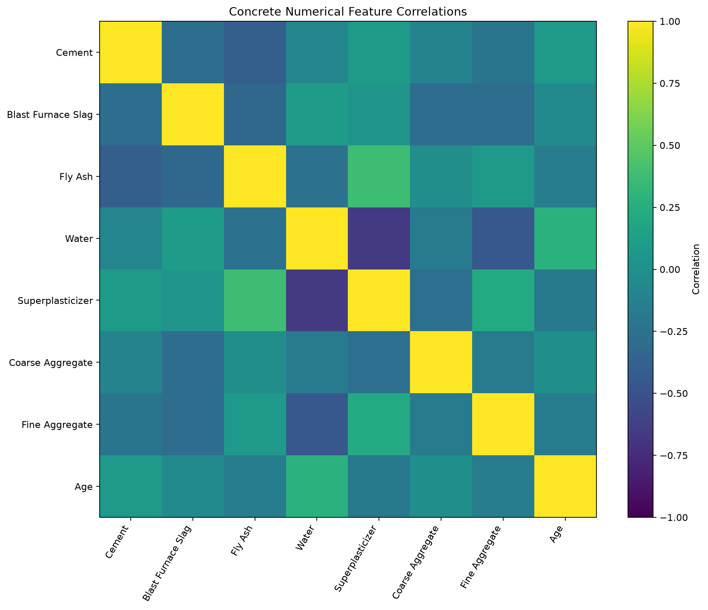
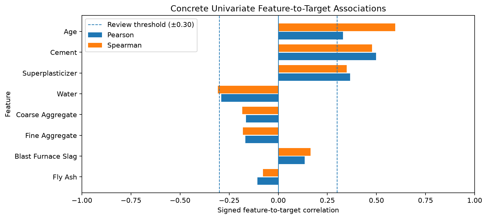
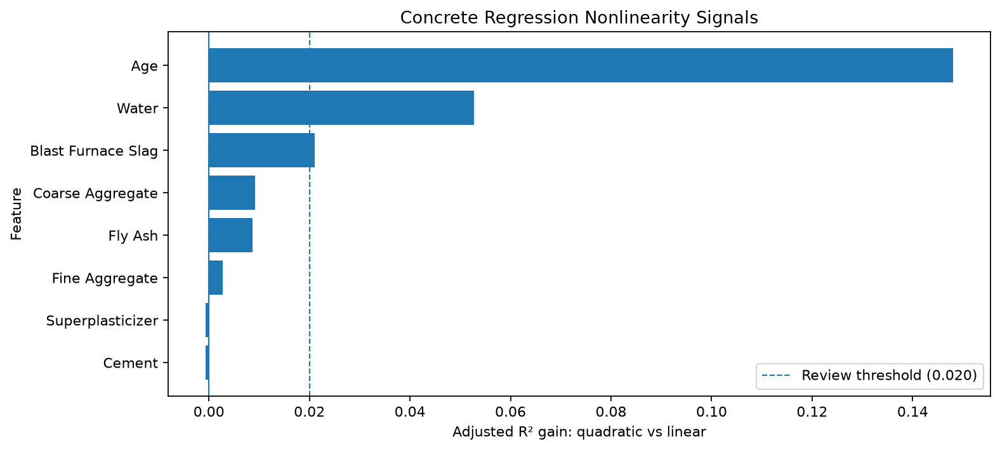
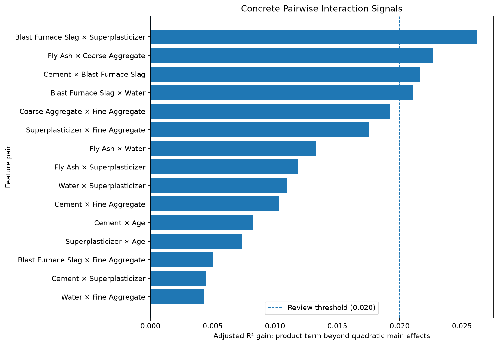

# Concrete Compressive Strength — Reproducible Continuous Regression Study

## Overview

This repository is an educational, reproducible continuous-regression study of
the **Concrete Compressive Strength** dataset from the UCI Machine Learning
Repository (dataset `165`, DOI `10.24432/C5PK67`). The source has 1,030 rows and
9 columns: eight numerical predictors and the continuous target **Concrete
compressive strength**, measured in MPa.

| Item | Value |
|---|---|
| Problem type | `continuous_regression` |
| Rows / columns | 1,030 / 9 |
| Predictors | 8 numerical features |
| Target | Concrete compressive strength |
| Target unit | MPa |
| Selected model | HistGradientBoostingRegressor |
| Feature policy | `all_features` |
| Operational modeling ready | No |
| Operational validity | Unconfirmed |

## Scientific workflow

```text
Raw UCI snapshot
        ↓
01 — Data Understanding and Exploration
        ↓
02 — Data Preparation
        ↓
03 — Model Selection and Evaluation
        ↓
04 — Final Model + One-Time Test + Bundle
        ↓
05 — Independent Inference Demo
```

Each notebook starts from persisted artifacts rather than live variables from
the preceding notebook. The test partition remains sealed through model
selection and is accessed only by Notebook 04 after the winner and finalization
contract are frozen. Notebook 05 is an independent, read-only consumer of final
artifacts.

## Dataset

Predictors, in contract order:

1. Cement
2. Blast Furnace Slag
3. Fly Ash
4. Water
5. Superplasticizer
6. Coarse Aggregate
7. Fine Aggregate
8. Age

The target is **Concrete compressive strength**, a quantitative continuous
measurement on its original MPa scale.

## Important data-quality findings

The current exploration and preparation evidence confirms:

- all 1,030 rows have a present, finite target;
- UCI metadata declares Blast Furnace Slag as Integer, while the materialized
  source is `float64`; 298 rows (28.932%) have non-integer values, which are
  preserved exactly;
- 11 exact-row-equality groups contain 36 rows;
- 19 repeated feature-profile groups contain 57 rows: 10 groups/33 rows share
  a target, while 9 groups/24 rows have target disagreement;
- no source observation identifier exists, so equality is not evidence of
  duplicate identity and no rows were removed;
- all eight predictors were retained, with no generic outlier removal,
  clipping, winsorization, target binning, or target transformation; and
- values outside 1.5-IQR fences are descriptive diagnostics, not deletion
  rules.

## Exploratory figures











## Preparation and split

Notebook 02 produces a static educational snapshot using a shuffled,
non-stratified regression split. Target bins are not used, and no learned
preprocessing is fit during preparation.

| Partition | Rows | Fraction |
|---|---:|---:|
| Train | 721 | 70% |
| Validation | 154 | 15% |
| Test | 155 | 15% |

The split ID is `shuffled-70-15-15-seed-42`; the primary seed is 42 and the
second-stage seed is 43. Technical row membership is integrity evidence, not a
claim of semantic observation identity. The test artifact stays sealed
downstream until Notebook 04.

## Model selection

Notebook 03 compares `DummyRegressor(strategy="median")`, Ridge,
DecisionTreeRegressor, RandomForestRegressor, and
HistGradientBoostingRegressor. Cross-validation uses train only with
`KFold(n_splits=5, shuffle=True, random_state=42)`. The primary metric is MAE
(lower is better); RMSE, R², and MedAE are secondary. The predeclared practical
tie tolerance is 0.10 MPa.

| Model | MAE | RMSE | R² | MedAE |
|---|---:|---:|---:|---:|
| Dummy median | 12.8145 | 15.8699 | -0.0005 | 11.2600 |
| Ridge | 8.5944 | 10.7533 | 0.5406 | 7.1671 |
| Decision Tree | 4.2860 | 6.5247 | 0.8309 | 2.9000 |
| Random Forest | 3.7689 | 5.4146 | 0.8835 | 2.5385 |
| HistGradientBoosting | 2.7417 | 4.0870 | 0.9336 | 1.8033 |

The frozen winner is `hist_gradient_boosting`, family
`HistGradientBoostingRegressor`, with `all_features`. Selected parameters are
`model__l2_regularization=1.0`, `model__learning_rate=0.1`,
`model__max_leaf_nodes=15`, and `model__min_samples_leaf=10`. The fixed
constructor contract includes `max_iter=300` and `random_state=42`.

## Final model and one-time test

Notebook 04 follows the fixed sequence: frozen winner → final fit → verified
model freeze → first test access → one test prediction → aggregate evidence.
The final fit uses train plus validation (721 + 154 = 875 rows); the test has
155 rows.

| Metric | Frozen Validation | Final Test | Test − Validation |
|---|---:|---:|---:|
| MAE (MPa) | 2.7417 | 2.5822 | -0.1595 |
| RMSE (MPa) | 4.0870 | 4.2104 | +0.1234 |
| R² | 0.9336 | 0.9387 | +0.0050 |
| MedAE (MPa) | 1.8033 | 1.6363 | -0.1669 |

Final-test diagnostics are: residual mean 0.7577 MPa, residual standard
deviation 4.1551 MPa, maximum absolute error 26.6252 MPa, and absolute-error
p50/p90/p95 of 1.6363/6.4306/7.7465 MPa. These are descriptive evidence, not
new thresholds.

## Final artifacts

Notebook 04 materializes five local runtime outputs:

- `final-pipeline.joblib` — fitted pipeline;
- `final-model-manifest.json` — frozen fit, runtime, and model contract;
- `final-test-evidence.json` — one-time aggregate test evidence;
- `inference-bundle.json` — input, output, runtime, and trust contract; and
- `final-model-handoff.json` — final readiness and lineage handoff.

The JSON contracts use v3 schemas where applicable. Runtime artifacts are
ignored by Git. The handoff and bundle authenticate lineage, and the model SHA
must be validated before joblib deserialization. The current model SHA-256 is
`6e6a5a970c6e91b4ae075c48e4cd4a3c21f0b45a9223e3945906fd8c8b2a5032`.

## Independent inference

Notebook 05 consumes final artifacts only: it does not access train,
validation, or test data; fit or select a model; or alter artifacts. It enforces
strict feature order, finite numeric input, declared dtypes, and a continuous
numeric output on the original MPa scale after trusted model loading.

The four current inputs are manually written illustrations, not dataset rows;
they have no ground truth and are neither a benchmark nor an accuracy measure.

| Example | Prediction (MPa) |
|---|---:|
| `illustrative_mix_early_age` | 29.994813 |
| `illustrative_mix_standard` | 46.098200 |
| `illustrative_mix_slag_fly_ash` | 53.969705 |
| `illustrative_mix_high_cement` | 67.761977 |

## Project structure

```text
notebooks/       official Concrete notebooks 01–05
scripts/         reusable validation, preparation, selection, and inference code
tests/           scientific contracts, compatibility, corruption, and hygiene tests
docs/images/     curated study figures
data/            local raw/processed runtime data plus data documentation
artifacts/       local handoffs, evidence, manifests, and model outputs
```

Binary and multiclass backward compatibility is protected by the shared Python
contracts and their dedicated tests; it does not depend on legacy notebooks.

## Reproducibility

The source project supports Python >= 3.10.

```bash
python -m pip install -e .
python -m pip install -e ".[test]"
python -m pip install -e ".[notebook,test]"

python -m scripts.download_data \
  uci 165 \
  --destination data/raw/concrete-compressive-strength

jupyter lab
```

The serialized model's bundle validates runtime compatibility. A model artifact
created under a particular runtime can therefore impose stricter trusted
deserialization requirements than the source project's `requires-python`.

## Running the notebooks

Run the official notebooks in order: 01, 02, 03, 04, then 05.

- 01 persists exploration evidence and the exploration handoff.
- 02 persists prepared data, split artifacts, quality/feature/split manifests,
  and the preparation handoff.
- 03 persists candidate/CV/validation evidence and freezes the selection
  handoff.
- 04 materializes the final pipeline, manifest, one-time test evidence, bundle,
  and final handoff. Its idempotent path preserves the one-time evidence; it is
  not a mechanism for repeated test re-evaluation.
- 05 validates and consumes final artifacts read-only for independent inference.

Runtime data and artifacts are not versioned and must be materialized locally.

## Tests

The suite covers source/data validation, continuous preparation, binary and
multiclass backward compatibility, continuous model selection, finalization,
inference, artifact corruption and fail-closed behavior, figure export, and
notebook cleanliness.

```bash
python -m pytest -q
```

## Scope and limitations

This is an educational and reproducible study, not a production-readiness
claim. The final handoff records `operational_modeling_ready=false` and
`operational_validity=unconfirmed`. The test partition was used only for the
one-time final evaluation and never for retuning. Independent inference examples
have no ground truth. No API, deployment surface, or operational validity is
claimed.

## Results summary

All eight features were retained and HistGradientBoostingRegressor was selected.
Its strong validation evidence was broadly consistent with the one-time final
test. Trusted independent continuous inference was demonstrated, while
production and operational validity remain outside the study scope.
