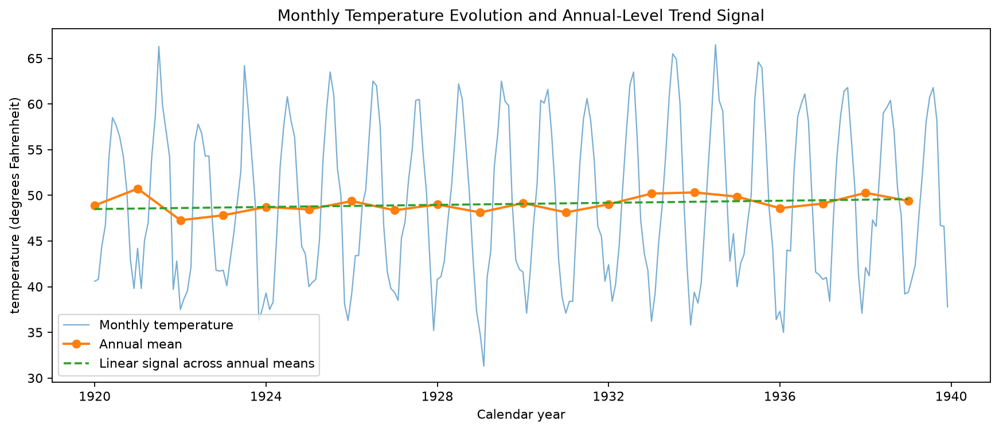
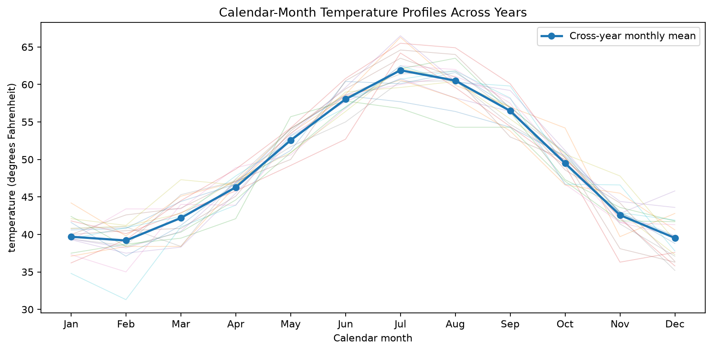
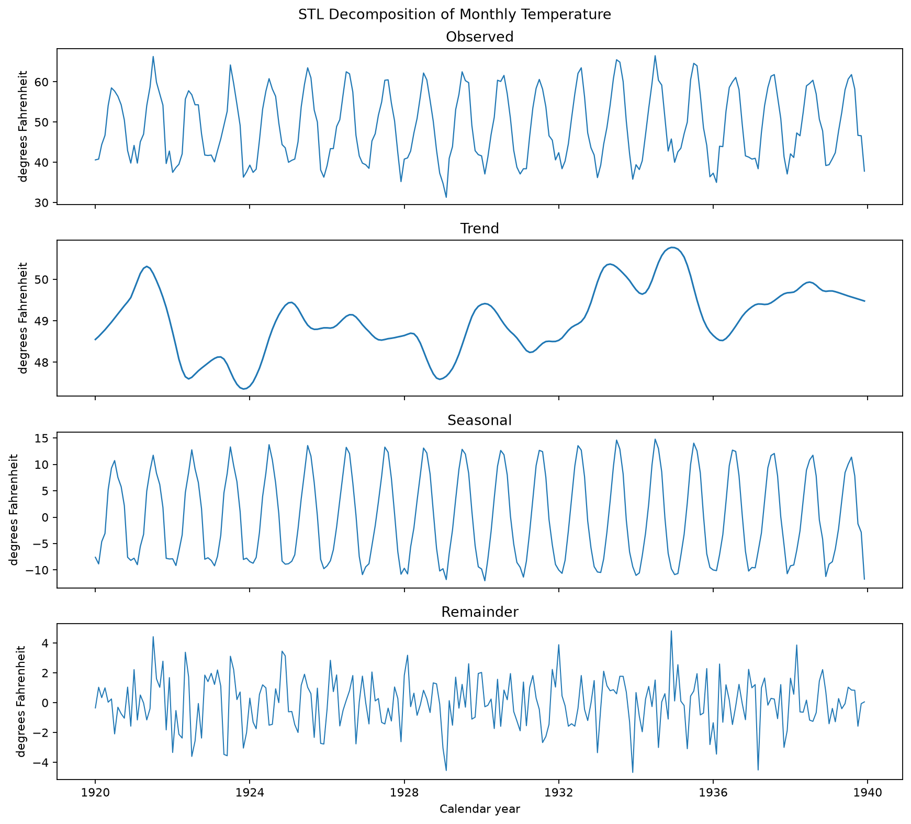
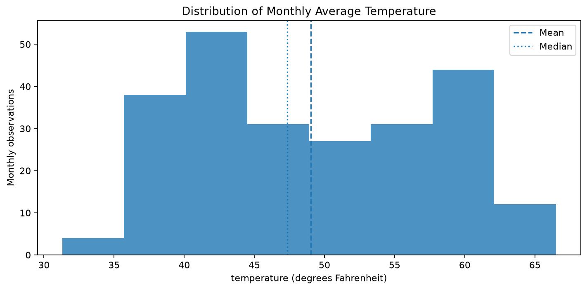
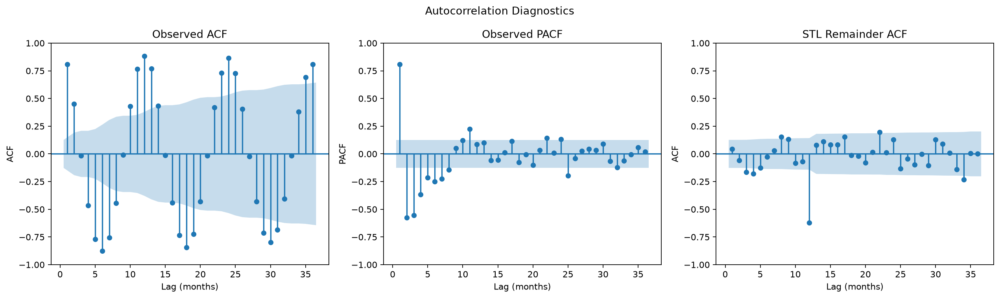
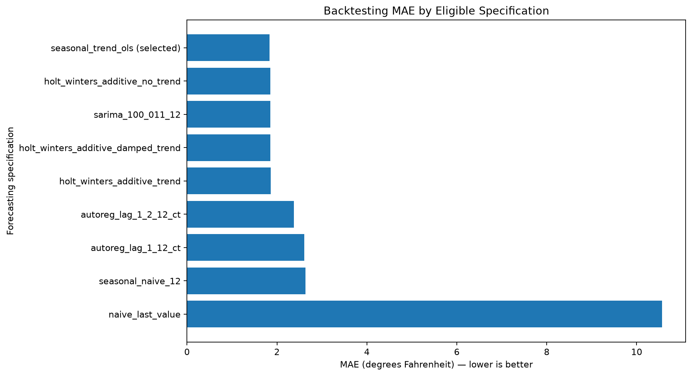
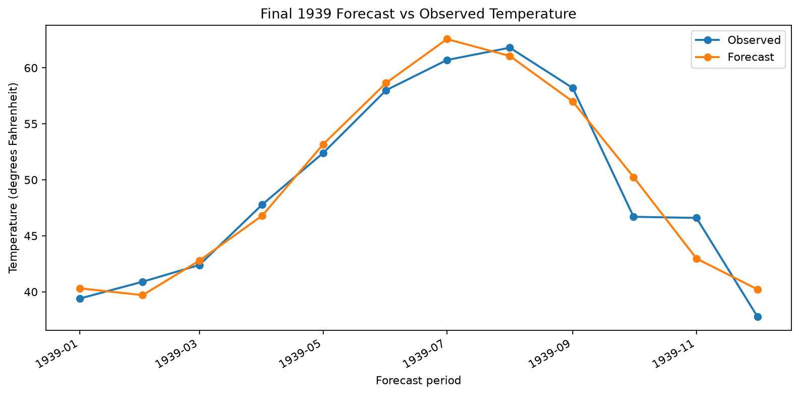

# Nottingham Monthly Temperatures — Dataset Study

Reproducible educational study of **univariate time-series forecasting** on the classic `datasets::nottem` monthly temperature series, covering source validation, temporal exploration, deterministic preparation, expanding-window backtesting, frozen model selection, one-time final-holdout evaluation, model serialization, and independent deterministic forecasting.

## At a glance

| Item | Result |
|---|---:|
| Scientific reference | `datasets::nottem` |
| Observations | 240 monthly values |
| Coverage | `1920-01` → `1939-12` |
| Target | `temperature` |
| Unit | degrees Fahrenheit (°F) |
| Source exogenous predictors | none |
| Problem type | Univariate forecasting |
| Forecast horizon | 12 months |
| Development history | 228 observations (`1920-01` → `1938-12`) |
| Final holdout | 12 observations (`1939-01` → `1939-12`) |
| Backtesting | 9 expanding-window folds |
| Primary metric | MAE |
| Selected model | `seasonal_trend_ols` |
| Selected family | `DeterministicSeasonalTrendOLS` |
| Backtesting MAE | **1.839438 °F** |
| Final-holdout MAE | **1.526584 °F** |
| Final-holdout RMSE | **1.859967 °F** |
| Final-holdout Seasonal MASE(12) | **0.555495** |
| Operational modeling ready | No |

## Study objective

The study investigates whether a compact monthly temperature series with strong annual seasonality can support reliable 12-month forecasting under a strictly temporal evaluation design.

The workflow addresses three questions:

1. **What temporal structure is present in Nottingham monthly temperatures?**
2. **Can learned forecasting specifications improve on meaningful seasonal and persistence baselines under expanding-window backtesting?**
3. **How does the frozen selected specification perform on the final 1939 holdout after model development is complete?**

The analysis is predictive rather than causal. Trend, seasonality, autocorrelation, and forecast performance describe statistical structure in the observed series; they do not establish a causal climate mechanism.

## Dataset and source

The dataset is the classic R `datasets::nottem` series, acquired in Python through `statsmodels.datasets.get_rdataset`.

| Item | Value |
|---|---|
| Scientific reference | `datasets::nottem` |
| Series | Nottingham Castle monthly air temperature |
| Semantics | Monthly average air temperature |
| Unit | degrees Fahrenheit |
| Frequency | monthly |
| Coverage | `1920-01` → `1939-12` |
| Observations | 240 |
| Source exogenous predictors | none |

The acquisition layer materializes a transport table with `time` and `value`. The notebooks reconstruct a monthly `PeriodIndex` and rename the endogenous value to `temperature`.

The source time coordinate is not treated as an ordinary tabular predictor.

## Acquisition

```bash
python -m scripts.download_data \
  rdataset nottem \
  --package datasets \
  --destination data/raw/nottem
```

The materialized source layout is:

```text
data/raw/nottem/dataset.csv
data/raw/nottem/metadata.json
data/raw/nottem/documentation.txt
```

## Forecasting contract

| Field | Value |
|---|---|
| Problem type | `time_series_forecasting` |
| Forecasting mode | `univariate` |
| Target | `temperature` |
| Target unit | degrees Fahrenheit |
| Frequency | `M` |
| Forecast horizon | 12 months |
| Exogenous predictors | none |
| Multi-step requirement | 12 future monthly forecasts from one origin |

Forecasting differs from ordinary shuffled tabular prediction because temporal order carries information and future observations must remain unavailable at each forecast origin.

Random train/test shuffling and ordinary K-fold evaluation are therefore inappropriate for this study.

## Data quality and temporal preparation

The canonical series contains 240 consecutive monthly observations.

The study finds:

- no missing canonical months;
- no duplicated canonical periods;
- no missing target values;
- no non-finite temperature values;
- no source exogenous predictors;
- no point anomalies meeting the predefined robust intervention threshold;
- no evidence requiring row deletion, interpolation, clipping, winsorization, or synthetic filling.

Preparation preserves the series on its original Fahrenheit scale.

No generic logarithmic transformation, Box-Cox transformation, global scaling, full-series detrending, globally fitted decomposition, or mandatory preprocessing differencing is applied.

### Temporal boundary

| Scope | Range | Observations | Purpose |
|---|---|---:|---|
| Development | `1920-01` → `1938-12` | 228 | Backtesting and final fitting |
| Final holdout | `1939-01` → `1939-12` | 12 | One-time final evaluation |

The final forecast origin is `1938-12`.

From Notebook 02 onward, the 1939 holdout remains unavailable for candidate comparison, metric-driven selection, retuning, and model adjustment until the final specification has been frozen.

### Important exploration caveat

Notebook 01 performs retrospective exploration of the complete 1920–1939 source before the final model-development boundary is sealed.

The 1939 holdout is therefore **prospectively sealed for model selection and final evaluation**, but it is **not exploration-blind in the strongest external-test sense**.

This is a documented study-design limitation rather than a violation of the later forecasting evaluation contract.

## Exploratory evidence

### Historical evolution

The 240 monthly observations have approximately:

| Statistic | Temperature |
|---|---:|
| Mean | 49.04 °F |
| Median | 47.35 °F |
| Minimum | 31.3 °F |
| Maximum | 66.5 °F |



The later years are modestly warmer on average than the earliest years in this record, but this long-run movement is much smaller than the recurring within-year seasonal variation.

The descriptive annual-mean slope is approximately `0.057 °F/year`, while the mean during `1935–1939` is approximately `0.76 °F` above the mean during `1920–1924`.

These descriptive values motivate consideration of trend terms; they do not establish a causal climate trend.

### Seasonal structure

Seasonality is the dominant systematic pattern.

July has the highest cross-year calendar-month mean and February the lowest. The calendar-month mean range is approximately **22.71 °F**.



STL diagnostics estimate seasonal strength at approximately `0.960`, compared with trend strength of approximately `0.241`.



The strong annual structure motivates a 12-month seasonal-naive primary baseline.

### Target distribution and autocorrelation



The marginal distribution should not be interpreted independently from time because each observation belongs to a recurring calendar position.

The strongest absolute autocorrelation within 36 months occurs at lag 12, at approximately `0.884` on the complete series and `0.886` within development history.



Exploratory decomposition and autocorrelation evidence are not reused as globally fitted future-aware preprocessing inputs.

## Evaluation protocol

### Expanding-window backtesting

| Property | Value |
|---|---:|
| Mode | Expanding window |
| Initial training history | 120 months |
| Forecast horizon per fold | 12 months |
| Origin step | 12 months |
| Folds | 9 |
| Validation years | 1930 → 1938 |
| Forecasts per complete specification | 108 |

Each fold:

1. fits the specification from scratch using only observations available at that forecast origin;
2. forecasts the next 12 months without validation-target feedback;
3. scores those 12 forecasts against the next calendar year;
4. expands the training history before the next origin.

Validation windows do not overlap and no backtesting fold reaches the 1939 final holdout.

### Metrics

| Metric | Role |
|---|---|
| MAE | **Primary model-selection metric** |
| RMSE | Secondary metric emphasizing larger misses |
| Seasonal MASE(12) | Secondary scale-free metric relative to 12-month seasonal-naive error scale |
| Horizon-wise absolute error / MAE | Diagnostic evidence |

`MAPE` and `sMAPE` are deliberately excluded because Fahrenheit has an arbitrary zero point, making percentage-of-observed-value error physically unstable for this target.

### Baselines

| Baseline | Definition |
|---|---|
| `seasonal_naive_12` | `y_hat[T+h] = y[T+h-12]` |
| `naive_last_value` | `y_hat[T+h] = y[T]` |

`seasonal_naive_12` is the primary benchmark.

## Model selection

The candidate catalog is frozen before evaluation and contains **two baselines plus eight learned forecasting specifications**.

Unlike the tabular studies that use hyperparameter-search algorithms, this forecasting study compares **predefined fixed specifications**. Each eligible learned candidate is reconstructed and fitted from scratch inside every training fold.

### Complete specification comparison

| Specification | Role | Family | Status | Pooled MAE ↓ | RMSE ↓ | Seasonal MASE(12) ↓ | Fold MAE std | h7–h12 MAE |
|---|---|---|---|---:|---:|---:|---:|---:|
| **`seasonal_trend_ols`** | Candidate | DeterministicSeasonalTrendOLS | **Selected** | **1.839438** | 2.320801 | **0.656960** | 0.388753 | 1.992052 |
| `holt_winters_additive_no_trend` | Candidate | ExponentialSmoothing | Practical-tie finalist | 1.850122 | 2.338465 | 0.660751 | **0.357276** | 1.979018 |
| `sarima_100_011_12` | Candidate | SARIMAX | Practical-tie finalist | 1.852289 | **2.305228** | 0.661688 | 0.405303 | **1.953598** |
| `holt_winters_additive_damped_trend` | Candidate | ExponentialSmoothing | Practical-tie finalist | 1.853886 | 2.342469 | 0.662140 | 0.380209 | 2.000767 |
| `holt_winters_additive_trend` | Candidate | ExponentialSmoothing | Practical-tie finalist | 1.857710 | 2.343873 | 0.663509 | 0.381700 | 2.001234 |
| `autoreg_lag_1_2_12_ct` | Candidate | AutoReg | Eligible | 2.376971 | 2.993368 | 0.848966 | 0.606632 | 2.243636 |
| `autoreg_lag_1_12_ct` | Candidate | AutoReg | Eligible | 2.607713 | 3.292361 | 0.931090 | 0.644302 | 2.556223 |
| `seasonal_naive_12` | Primary baseline | SeasonalNaive | Eligible baseline | 2.637963 | 3.338898 | 0.941686 | 0.389743 | 2.557407 |
| `naive_last_value` | Secondary baseline | NaiveLastValue | Eligible baseline | 10.563889 | 13.267843 | 3.770738 | 2.181979 | 13.283333 |
| `sarima_100_100_12` | Candidate | SARIMAX | **Incomplete / ineligible** | — | — | — | — | — |

The incomplete `sarima_100_100_12` specification completed only 2 folds and 24 forecast rows before its explicit optimizer-failure policy blocked the candidate. It is retained in the documented catalog rather than silently removed from the experiment.



### Fixed candidate configurations

| Specification | Fixed hyperparameters / forecasting policy |
|---|---|
| `seasonal_naive_12` | Seasonal lag `12`; direct known-history lookup |
| `naive_last_value` | Constant forecast from final training observation |
| `seasonal_trend_ols` | `intercept=True`; `linear_time_trend=True`; 11 calendar-month dummies; January reference |
| `holt_winters_additive_no_trend` | `trend=None`; `damped_trend=False`; `seasonal="add"`; `seasonal_periods=12`; `initialization_method="estimated"`; `use_boxcox=False` |
| `holt_winters_additive_damped_trend` | `trend="add"`; `damped_trend=True`; `seasonal="add"`; `seasonal_periods=12`; `initialization_method="estimated"`; `use_boxcox=False` |
| `holt_winters_additive_trend` | `trend="add"`; `damped_trend=False`; `seasonal="add"`; `seasonal_periods=12`; `initialization_method="estimated"`; `use_boxcox=False` |
| `autoreg_lag_1_12_ct` | `lags=[1,12]`; `trend="ct"`; `seasonal=False`; `old_names=False` |
| `autoreg_lag_1_2_12_ct` | `lags=[1,2,12]`; `trend="ct"`; `seasonal=False`; `old_names=False` |
| `sarima_100_100_12` | `order=(1,0,0)`; `seasonal_order=(1,0,0,12)`; `trend="ct"`; `enforce_stationarity=True`; `enforce_invertibility=True` |
| `sarima_100_011_12` | `order=(1,0,0)`; `seasonal_order=(0,1,1,12)`; `trend="n"`; `enforce_stationarity=True`; `enforce_invertibility=True`; fold-local seasonal differencing `D=1` |

All learned candidates operate on the original target scale with no source exogenous predictors and no globally learned preprocessing.

### Practical-tie selection

The best raw pooled MAE is:

```text
1.8394375020631275 °F
```

The frozen practical-tie tolerance is:

```text
0.05 °F
```

Five candidates fall within that tolerance:

1. `seasonal_trend_ols`
2. `holt_winters_additive_no_trend`
3. `sarima_100_011_12`
4. `holt_winters_additive_damped_trend`
5. `holt_winters_additive_trend`

The deterministic tie-break order is:

1. pooled Seasonal MASE(12);
2. pooled RMSE;
3. fold-to-fold MAE standard deviation;
4. long-horizon MAE across horizons 7–12;
5. model complexity rank;
6. candidate ID.

Under this rule, **`seasonal_trend_ols` is selected**.

Its pooled MAE improves on the primary `seasonal_naive_12` baseline by:

```text
0.798525 °F
```

or approximately:

```text
30.27%
```

## Selected model

The selected family is:

```text
DeterministicSeasonalTrendOLS
```

The frozen specification uses:

| Component | Configuration |
|---|---|
| Intercept | Yes |
| Linear time trend | Yes |
| Seasonal representation | 11 calendar-month dummy variables |
| Reference month | January |
| Seasonal period | 12 months |
| Source exogenous predictors | None |
| Differencing | None |
| Global learned preprocessing | None |
| Multi-step strategy | Direct known-calendar design for 12 future months |
| Fold fitting | Fit from scratch on each training fold |

The model represents temperature as a deterministic combination of gradual linear time movement and recurring monthly seasonality.

The final model artifact is forecasting-specific and serialized with `joblib`; it is not a scikit-learn `Pipeline`.

## Final holdout evaluation

After selection is frozen, the selected specification is fitted exactly once on the full development history:

```text
1920-01 → 1938-12
228 observations
```

It then produces exactly one 12-month forecast for:

```text
1939-01 → 1939-12
```

The holdout is opened for scoring exactly once.

| Metric | Backtesting reference | Final 1939 holdout | Final − backtesting |
|---|---:|---:|---:|
| MAE ↓ | 1.839438 | **1.526584** | -0.312854 |
| RMSE ↓ | 2.320801 | **1.859967** | -0.460834 |
| Seasonal MASE(12) ↓ | 0.656960 | **0.555495** | -0.101464 |

The numerically lower final errors are descriptive evidence from one calendar year. They do not prove that the model will systematically outperform its multi-origin backtesting estimates in future periods.

### Final 1939 forecast

| Period | Horizon | Observed °F | Forecast °F | Absolute error °F |
|---|---:|---:|---:|---:|
| 1939-01 | 1 | 39.4 | 40.3148 | 0.9148 |
| 1939-02 | 2 | 40.9 | 39.7042 | 1.1958 |
| 1939-03 | 3 | 42.4 | 42.7885 | 0.3885 |
| 1939-04 | 4 | 47.8 | 46.8148 | 0.9852 |
| 1939-05 | 5 | 52.4 | 53.1727 | 0.7727 |
| 1939-06 | 6 | 58.0 | 58.6463 | 0.6463 |
| 1939-07 | 7 | 60.7 | 62.5674 | 1.8674 |
| 1939-08 | 8 | 61.8 | 61.0569 | 0.7431 |
| 1939-09 | 9 | 58.2 | 56.9937 | 1.2063 |
| 1939-10 | 10 | 46.7 | 50.2463 | 3.5463 |
| 1939-11 | 11 | 46.6 | 42.9727 | 3.6273 |
| 1939-12 | 12 | 37.8 | 40.2253 | 2.4253 |



The largest final-holdout misses occur in October and November. Several spring and early-summer months are forecast more closely.

## Forecasting diagnostics

Backtesting performance varies across forecast origins and horizons.

The selected model's fold-to-fold MAE standard deviation is approximately:

```text
0.388753 °F
```

Its long-horizon MAE across horizons 7–12 is approximately:

```text
1.992052 °F
```

Horizon-wise backtesting error is not monotonic: forecasting difficulty does not simply increase one month at a time as horizon grows.

These diagnostics should be interpreted as evidence aggregated across historical forecast origins and not confused with the 12 single-origin errors from the final 1939 forecast.

## Inference contract

Notebook 05 and `scripts/forecasting_inference.py` provide a read-only deterministic inference contract for the frozen model.

### Input

A `pandas.DataFrame` with exactly:

```text
period
temperature
```

Requirements:

- monthly periods;
- unique periods;
- strictly increasing chronology;
- contiguous history;
- numeric-coercible finite temperatures;
- no missing values;
- history ending at or after frozen training end `1938-12`;
- no exogenous predictors.

The supplied history establishes forecast chronology/origin only.

```text
refit_on_input = false
```

For `seasonal_trend_ols`, inference-time temperature values do not update the frozen coefficients.

### Output

Exactly 12 future rows:

```text
period
forecast
```

The future horizon is fixed by the authenticated model contract rather than supplied by the caller.

This is a narrow forecasting-specific API rather than a general tabular batch-prediction contract.

## Workflow and notebooks

```text
Source series
    -> 01 time-series understanding and exploration
    -> 02 temporal preparation and sealed final-holdout boundary
    -> 03 expanding-window model selection
    -> 04 final fit, freeze, and one-time 1939 evaluation
    -> 05 independent read-only inference demonstration
```

| Notebook | Responsibility |
|---|---|
| `01_data_understanding_and_exploration.ipynb` | Retrospective source validation, temporal structure, seasonality, dependence, and exploration handoff |
| `02_data_preparation.ipynb` | Canonical monthly series, development/holdout split, backtesting schedule, preparation handoff |
| `03_model_selection_and_evaluation.ipynb` | Frozen candidate catalog, expanding-window backtesting, practical-tie selection, model-selection handoff |
| `04_final_model_and_bundle.ipynb` | Exact selected-specification reconstruction, full-development fit, one-time holdout scoring, final artifacts |
| `05_inference_demo.ipynb` | Independent authenticated model loading and deterministic future forecast demonstration |

## Reproducibility

Python `>=3.10` is required.

Install:

```bash
python -m pip install -e ".[notebook,test]"
```

Acquire the data:

```bash
python -m scripts.download_data \
  rdataset nottem \
  --package datasets \
  --destination data/raw/nottem
```

Execute notebooks 01 through 05 in order, then run:

```bash
python -m pytest -q
```

Curated documentation figures are exported by their owner notebooks through the generic `scripts.export_figures.export_figure` helper.

Runtime raw data, processed data, JSON/CSV evidence, handoffs, and serialized model files are intentionally excluded from normal Git versioning and must be regenerated locally.

## Repository structure

```text
notebooks/        authoritative notebooks 01–05
scripts/          reusable exploration, preparation, selection, finalization, and inference code
tests/            scientific contracts, corruption checks, compatibility, and notebook hygiene
docs/images/      versioned documentation figures
data/             local runtime data plus documentation
artifacts/        local handoffs, evidence, manifests, and model artifacts
README.md
pyproject.toml
```

## Limitations

- The dataset contains only 240 monthly observations, corresponding to 20 annual cycles.
- Development uses 228 observations and the final holdout contains only 12.
- The final 1939 holdout is prospectively sealed from Notebook 02 onward but is not exploration-blind because Notebook 01 inspected the full 1920–1939 series.
- The final holdout represents only one calendar year.
- No exogenous climate, atmospheric, geographic, or measurement predictors are available.
- The selected model assumes a stable recurring monthly seasonal pattern plus a linear time component.
- One frozen SARIMA candidate is incomplete and ineligible because its explicit optimizer-failure policy blocked evaluation after two folds.
- Exploratory autocorrelation, decomposition, trend summaries, and forecasting success do not identify a causal data-generating mechanism.
- No calibrated forecast intervals or probabilistic uncertainty distribution are produced.
- Performance under structural climate change, missing periods, source revision, measurement changes, or other distribution shift is untested.
- No production drift-monitoring or scheduled-retraining policy is established.
- The final frozen model does not learn from inference-time temperature values.
- `operational_modeling_ready = false` remains an explicit project boundary.

## Responsible interpretation

The evidence supports a focused forecasting conclusion:

> Nottingham Monthly Temperatures is a small, clean, strongly seasonal monthly series. Under nine-fold expanding-window backtesting, the deterministic seasonal-trend OLS specification achieves a pooled MAE of approximately **1.8394 °F**, RMSE of **2.3208 °F**, and Seasonal MASE(12) of **0.6570**, improving MAE by about **30.3%** relative to the seasonal-naive reference. After model selection is frozen, the same specification fitted to the complete development history achieves a final 1939 MAE of approximately **1.5266 °F**, RMSE of **1.8600 °F**, and Seasonal MASE(12) of **0.5555**.

The study demonstrates disciplined multi-step time-series forecasting, temporal evaluation, explicit baseline comparison, deterministic tie-breaking, and one-time holdout scoring.

It does not establish causal climate effects, guarantee future accuracy, or demonstrate operational forecasting validity outside the documented dataset and evaluation design.
